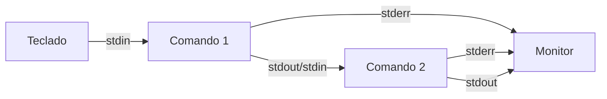

# 1er [Diplomado de Bioinformática y Docking](../)

## Introducción a Linux

### Operaciones avanzadas con archivos

#### Uso de comodines

En linux, cuando se utilizan comandos que requieren argumentos que son rutas de ficheros, se pueden utilizar comodines para hacer coincidencias entre los nombres _o rutas_ de los archivos que tienen un patrón en común. Los caracteres que se usan para generar esos comodines se explican a continuación:

 - `?` Se utiliza cuando hay varios ficheros que solo difieren en un caracter, si se usa el caracter `?` en lugar de los caracteres diferentes, los ficheros cumplen la condición. Por ejemplo `list?s.txt` es una coincidencia para `listas.txt` y `listos.txt`.
 - `*` Es el más usual, se utiliza cuando sin importar el tamaño en caracteres de la subcadena de texto diferente, existe una cadena que hace coincidir a los nombres de los archivos. Por ejemplo `li*.txt` es una coincidencia para `listas.txt`, `listos.txt` y `literatura.txt`. 
 - `[]` Se usan cuando hay ficheros que difieren en un solo caracter, y además ese caracter corresponde a una lista de caracteres permitidos. A diferencia de `?`, que admite cualquier caracter, con este comodín podemos definir un conjunto de caracteres. Por ejemplo `list[au]s.txt` es una coincidencia para `listas.txt` pero no para `listos.txt` (si existiese un fichero `listus.txt`, sí sería coincidencia).
 - `!` Se utiliza en combinación con `[]`, significa que el caracter que es diferente entre los nombres de los ficheros puede ser cualquiera, excepto los que se definen en el conjunto. Por ejemplo `list[!au]s.txt` es una coincidencia para `listos.txt` pero no para `listas.txt` (si existiera el fichero `listus.txt` tampoco sería coincidencia).

Cuando se utilizan los comodines, cada fichero que tenga un nombre que coincide con la expresión que usa el o los comodines, se convierte en un argumento separado de los demás por espacios, así
```bash
comando li*.txt
```
se interpreta como
```bash
comando listas.txt listos.txt literatura.txt
```
Practicamente todos los comandos que operan con archivos de texto pueden beneficiarse de este uso de comodines.

#### Comandos de inspección

Cuando se inicia un proceso de procesamiento de datos en linux siempre conviene iniciar mediante una exploración general de los archivos. Es muy usual que una vez que nos encontremos en el directorio de trabajo, existan diversos archivos que podemos utilizar. Por esa razón lo primero que se suele hacer es hacer una inspección rápida de los ficheros en el directorio, desplegando información importante como permisos, tamaño, propietarios, etc:

```bash
ls -lh
```
 
 este comando nos despliega información en forma de columnas con la siguiente información:
 
 1. Tipo de archivo
 2. Permisos
 3. Número de ligas fuertes al archivo
 4. Usuario propietario
 5. Grupo del archivo
 6. Tamaño (en formarto humanamente legible)
 7. Tiempo de la última modificación del archivo
 8. Nombre del archivo

Cabe mencionar que la primera columna combina el contenido del tipo de archivo y los permisos usando 10 caracteres, (el primero determina el tipo de archivo, los restantes 9 despliegan el esquema de asignación de permisos). A continuación un ejemplo del resultado de usar el comando `ls -lh`:

```bash
total 48K
-rwxrw-r-- 1 roberto roberto  39K Apr 13 10:04 ejemplo.txt
-rw-r--r-- 1 example grupo   6.9K Apr 13 10:19 file.txt
```

Con esta aproximación obtenemos información muy relevante, como el tamaño de los archivos, las extensiones de los mismos, y una mirada rápida al esquema de permisos para poder interaccionar con los archivos.

Es muy conveniente utilizar entonces un comando adicional para cerciorarse de que un archivo es del tipo de archivo que esperamos de acuerdo al nombre, para ello usamos el comando `file`:

```bash
file mi_archivo.xxx
```
Este comando puede aportar información muy interesante:

```bash
mi_archivo.xxx: ASCII text, with very long lines
```
```bash
mi_archivo.xxx: ASCII text, with CRLF line terminators
```
```bash
mi_archivo.xxx: Variant Call Format (VCF) version 4.2, ASCII text
```
```bash
mi_archivo.xxx: Bourne-Again shell script, ASCII text executable 
```

Con esa información podemos descartar algunos escenarios desde el inicio. Tipicamente lo que nos interesa descartar en este punto es que un archivo a pesar de tener una extensión en específico, contenga datos correspondientes a un formato diferente. A contuniación se muestra como pudiera verse un archivo binario con la información desplegada por este comando:

```bash
mi_archivo.xxx: PDF document, version 1.6
```
```bash
mi_archivo.xxx: ELF 64-bit LSB shared object, x86-64, version 1 (SYSV), dynamically linked, interpreter /lib64/ld-linux-x86-64.so.2, for GNU/Linux 2.6.32, with debug_info, not stripped 
```

Finalmente, otro comando muy útil, una vez que estamos seguros de que trabajamos con un archivo de texto  es utilizar el comando `wc`. Este comando sirve para obtener mediciones generales del contenido de texto en nuestro archivo, el comando usa la siguiente sintáxis:

```bash
wc [OPCIONES] [ARCHIVO]
```

Una forma general de ejecutarlo es de la siguiente forma:

```bash
wc mi_archivo.txt
```

el resultado está desplegado en 4 columnas:

 1. Cantidad de líneas (caracteres de nueva línea)
 2. Cantidad de palabras (cadenas de texto que se separan por caracteres de nueva línea, espacios o tabuladores)
 3. Cantidad de bytes (normalmente un byte equivale a un caracter _excepto en codificaciones de mas de 8 bits_)
 4. Nombre del archivo

#### Comandos de descomposición

```bash
head [OPCIONES] [ARCHIVOS]
```

El comando `head` retorna las primeras `10` líneas de un archivo de texto, con el modificador `-n` se puede agregar el número de líneas que necesitamos desplegar de vuelta:

```bash
head -n 15 file.txt
```
***
```bash
tail [OPCIONES] [ARCHIVOS]
```

El comando `tail` retorna las últimas `10` líneas de un archivo de texto, con el modificador `-n` se puede agregar el número de líneas que necesitamos desplegar de vuelta:

```bash
tail -n 20 file.txt
```
***

```bash
split [OPCIONES] [ARCHIVO]
```

El comando `split` divide el contenido de un archivo y genera nuevos archivos con el contenido separado. La opción `-n` define la cantidad de archivos de salida, en ese caso cada archivo de salida tiende a tener el mismo tamaño. La opción `-l` genera tantos archivos como sean necesarios, todos con una cantidad de líneas establecidas. Los archivos que son generados siguen nombres que si se ordenan lexicográficamente y se concatenan sus contenidos, se recuperaría el archivo original.

```bash
split -n 15 file.txt
split -l 30 file.txt
```

#### Comandos de lectura amortiguada

```bash
more archivo.txt
```
El comando `more` permite leer un archivo por segmentos o ventanas. Para avanzar se usa la tecla `<ENTER>`, al llegar al final del documento, la interfaz del comando more se cerrará devolviendo el prompt. Si se desea salir de la interfaz antes de llegar al final se puede hacer con la tecla `q`.

***

```bash
less archivo.txt
```
El comando `less` también permite leer un archivo por segmentos o ventanas. La ventaja de este comando es que permite una interacción más avanzada en el proceso de inspección. Para moverse por el archivo se pueden usar las teclas de navegación ( ⬆️ ⬇️ ⬅️ ➡️ ) , al llegar al final del documento el prompt no regresa de manera automática, es necesario salirse de la interfaz con la tecla `q`. 

#### Comandos de descomposición

```bash
split [OPCIONES] [ARCHIVO]
```

El comando `split` divide y separa el contenido de un archivo de texto en fragmentos con la información segmentada en proporciones, respecto a un número de archivos, tamaño en _bytes_ o número de líneas. A continuación se muestran ejemplos de uso:

```bash
#Separando por número de líneas en los archivos de salida:
split -l 10 archivo.txt
#Separando por número de archivos:
split -n 6 arcchivo.txt
#Separando por número de bytes en los archivos de salida:
split -b 300 archivo.txt
```

Este comando requiere de permisos de escritura en el directorio donde se ejecute, ya que la instrucción genera nuevos archivos que contienen cada uno un segmento del archivo original. Cada archivo es creado con un nombre diferente, y esos nombres siguen un **orden lexicográfico** (por defecto) de tal forma que si se concatenan todos, el resultado es el contenido del archivo original.

#### Diferenciación

```bash
diff archivo_uno.txt archivo_dos.txt
```

La comparación entre archivos es muy importante en algunas tareas, un ejemplo claro es el control de versiones. Este comando permite revisar el contenido de una pareja de archivos, enfocándose en las diferencias que existen entre los mismos. Como resultado se imprimen las líneas que deberían modificarse en ambos archivos para contener la misma información. Es muy importante aclarar que el algoritmo de revisión hace la comparación basada en el orden de líneas que tienen cada uno de los archivos de entrada, y como tal las comparaciones son hechas línea por línea.

Se puede usar el modificador `-i` para omitir diferencias entre mayúsculas y minúsculas (por ejemplo, `Solaria Biodata` sería una cadena idéntica a `SOLARIA biodata`).

La salida del comando es una serie de secciones que representan comandos de cambio de este estilo:

```
comando-de-cambio
< linea-del-archivo 
---
> linea-al-archivo
```

Cada `comando-de-cambio` tiene una estructura como esta:

 - El número de línea o rango de líneas en el primer archivo
 - Un caracter de cambio especial
   - `a` Agrega las líneas
   - `c` Cambia las líneas
   - `d` Elimina las líneas 
 - El númer de línea o rango de líneas en el segundo archivo

El comando de cambio es seguido por las líneas completas que se necesitan remover (precedidas  por `<`) o agregar (precedidas por `>`) al archivo.

Otro modificador interesante es `-u`, el cual genera que la salida del comando siga los lineamientos de una convención universal para la comparación entre archivos. Esta es más sencilla de interpretar por los seres humanos.

***

```bash
sdiff archivo_uno.txt archivo_dos.txt
```

Debido a la salida compleja del comando `diff`, se ha implementado en algunas versiones del kernel de Linux una alternativa: `sdiff`. Este comando da como salida una representación _side by side_ de la comparación entre ambos archivos.

#### Comandos de manipulación

```bash
sort [OPCIONES] [ARCHIVO]
```

El comando de ordenamiento `sort` implementa un algoritmo de ordenamiento de elementos _o líneas_ de un archivo. El ordenamiento que se genera por defecto es lexicográfico, sin embargo es posible cambiar este comportamiento.

| Modificador | Significado | Descripción |
|--|--|--|
|`-n`| Ordenamiento númerico | Cambia el método de ordenamiento así un `10` podría ir despues de un `9` |
|`-k`| Ordenar por columna | Utiliza una columna de un archivo tabular para que el valor de dicha columna sea el valor de ordenamiento de la línea. Despues del modificador es necesario indicar el número de la columna deseada, por ejemplo para ordenar por la tercera columna usaríamos `-k 3`|
|`-t`| Indica el separador de columnas | Se utiliza para definir un caracter de separación de columnas, siempre en combinación con `-k`. Un ejemplo de uso sería `-t "," -k 3` |
|`-r`| Orden reverso | Cambia el ordenamiento para ser descendente |
|`-R`| Orden aleatorio | Realiza un ordenamiento en el que los valores siguen un ordenamiento aleatorio|
|`-u`| Elimina duplicados | Realiza el ordenamiento y si existen líneas iguales contiguas elimina las necesarias para solo quedar un valor, de esa forma todas las líneas de la salida son diferentes |

***

```bash
uniq [OPCIONES] [ARCHIVO]
```

Se utiliza para descartar líneas duplicadas de un archivo. Este comando opera revisando cada línea comparándola unicamente con la anterior, por lo tanto solo elimina duplicados contiguos. En archivos desordenados su salida puede contener líneas idénticas, sin embargo nunca serán contiguas. Se puede modificar su salida mediante los siguientes modificadores:

 - `-u` Solo imprime los elementos que no tienen repeticiones contiguas.
 - `-d` Solo imprime los elementos que sí tienen repeticiones contiguas.
 - `-c` Imprime un conteo de la cantidad de veces contiguas que aparece un elemento.

***

```bash
paste archivo_uno.txt archivo_dos.txt
```
Permite fusionar las columnas de dos archivos tabulares, agregando las columnas de ambos archivos. La opción `-d` permite seleccionar el caracter de separación entre las columnas de ambos archivos (por ejemplo `-d ","` generará que cada línea del primer archivo se separe de cada línea del segundo mediante un caracter `,`. Otra opción, `-s` genera que el acomodo de las líneas sea seriado (equivalente a transponer el resultado).

#### Redireccionamiento

En linux se pueden redireccionar las salidas y entradas.



|Caracter de redireccionamiento| Descripción|
|--|--|
|`>`| Redirige `stdout` a fichero |
|`2>`| Redirige `stderr` a fichero |
|`>&`| Redirige `stdout` y `stderr` a fichero |
|`<`| Redirige `stdin` a un comando |
|`|`| Redirige `stdout` de un comando a `stdin` de otro comando |
|`>>`| Agrega `stdout` a fichero |
|`2>>`| Agrega `stderr` a fichero |
|`>>&`| Agrega `stdout` y `stderr` a fichero |

[Menú Principal](../)

[Atras](./operacionesArchivosTexto)

[Siguiente](#)
